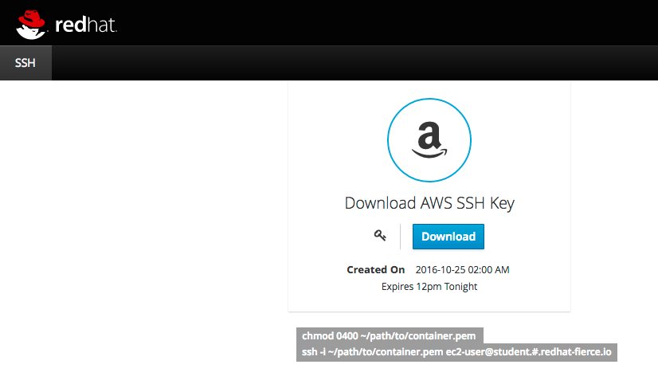

# Containers Workshop


`Containers Workshop` is a ansible playbook to provision docker/container servers in AWS. This playbook uses Ansible to wrap Terraform, for provisioning AWS infrastructure and nodes. To find more info about Terraform [check here](https://www.terraform.io/docs/providers/aws/index.html)

These modules all require that you have AWS API keys available to use to provision AWS resources. You also need to have IAM permissions set to allow you to create resources within AWS. There are several methods for setting up you AWS environment on you local machine. 

Export the `AWS API Keys` by hand;

```
export AWS_ACCESS_KEY_ID='****************WFQ'
export AWS_SECRET_ACCESS_KEY='****************TFHJw'
```

This repo also requires that you have Ansible installed on your local machine. For the most upto date methods of installing Ansible for your operating system [check here](http://docs.ansible.com/ansible/intro_installation.html).

Install Boto for Ansible AWS Cloud Modules.

```
pip install boto
```

This repo also requires that Terraform be installed if you are using the `aws.infra.terraform` role. For the most upto data methods of installing Terraform for your operating system [check here](https://www.terraform.io/downloads.html)

## AWS Infrastructure Roles


### role/aws.infra.terraform

Configure the workshop with your [api keys](https://aws.amazon.com/developers/access-keys/) and domain & [zone id](http://docs.aws.amazon.com/Route53/latest/DeveloperGuide/CreatingHostedZone.html) name for the workshop. Also fill in the `num_nodes` for the amount of students in the class. Also ensure that you have a `~/.ssh` folder created.  

`roles/aws.infra.terraform/vars/main.yml`

```
# file: roles/aws.infra.terraform/vars/main.yml
---
#####################################################
# Domain Name you own
#####################################################
domain_name: ""
zone_id: ""

#####################################################
# AWS API Keys for terraform.tfvars file
#####################################################
aws_access_key: ""
aws_secret_key: ""

region: "us-east-1"

#####################################################
# SSH Key Vars:
#####################################################
ssh_key_path: "{{ lookup('env','HOME') }}/.ssh"


#####################################################
# Number of Students
#####################################################
num_nodes: 10
```
To create infrastructure and a instance via Terraform 

```
cd Containers_Workshop
ansible-playbook -i inventory 1_aws_infra.yml --tags "tf_create" 
```

To destroy

```
cd /tmp/terraform
terraform destroy
```

## Configure Container Workshop

### role/container.workshop

Configure the role with your private RHEL subscription info & the workshop password:

`roles/container.workshop/vars/main.yml`

```
# file: roles/container.workshop/vars/main.yml
---
#####################################################
# RHEL Subscription Info:
#####################################################
username: ""
password: ""
pool_id: ""

workshop_password: "containers!@#"  
```

To target the newly created EC2 instance use the `inventory` folder. The [ec2.py](http://docs.ansible.com/ansible/intro_dynamic_inventory.html) is a dynamic script that queries Amazon for your instances. The `container.workshop` role sets up the student environment.

### Use `aws tags` to query AWS for your instance by AWS Tags


```
ansible-playbook -i inventory 2_aws_ec2.yml
```


## Students connect to their instance

Students should use a web browser to connect to their instance and download the ssh key from the newly created instance. 


```
student.*.redhat-fierce.io
```


